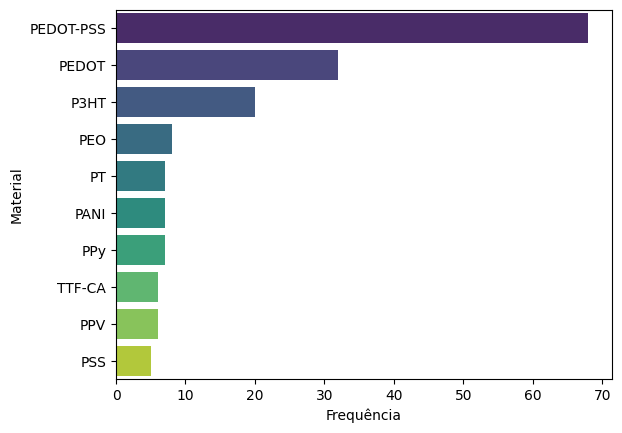
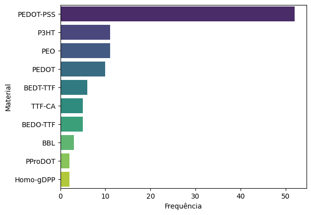

**Input:** "For the text I will input next, output only polymers of the type OMIEC, also known as Organic Mixed Ionic Electronic Conductors. Do not output other types of polymers, and other kinds of materials, only the polymers. The output must be only the polymer material names separated by semicolons. Do not repeat the polymer name more than once. Do not output 'OMIEC' or 'OMIEC based', tell me the name of the polymer that is of this type. If no polymer was found, output 'None'"

**Raw**: OMIEC_07_08_24.xls

**Output:** llama3-8B-OMIEC_RESPONSES.xlsx

---

**Input:** "For the text I will input next, provide only the names of OMIEC polymers, also known as Organic Mixed Ionic Electronic Conductors, that are present in the text. If any polymer that meets the condition is found in the text, the output should be only the polymer material names separated by semicolons. If no polymer that meets the condition is found in the text, the output should be 'None'. Do not repeat the polymer name more than once. The output should not include the type of material. I want to use the output for future data analysis, so if the polymer name is written in full, replace it with its abbreviation."

**Raw**: OMIEC_07_08_24.xls

**Output:** llama3-70B-OMIEC_RESPONSES.xlsx

